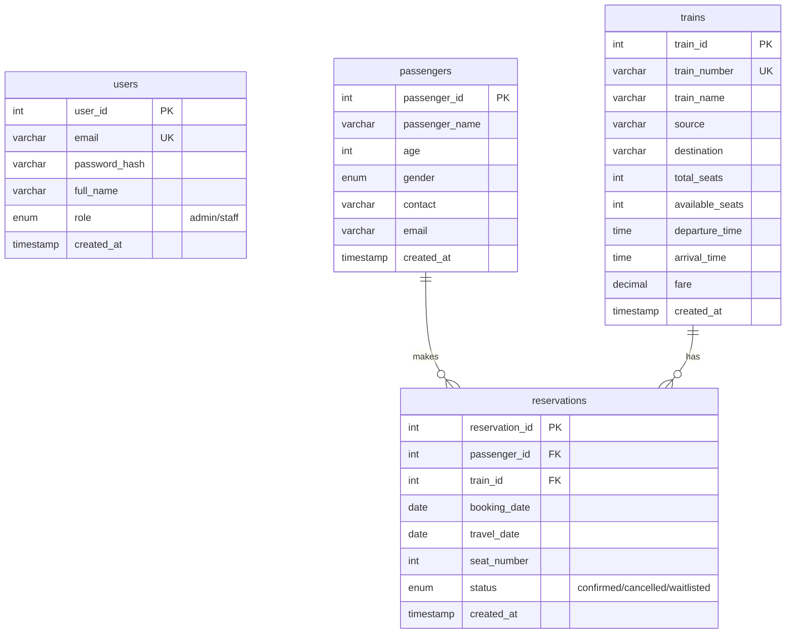

# Entity-Relationship Diagram

### Relationships Explained:
- **Passenger to Reservation (1:N)**: A passenger can make zero or multiple reservations. If a passenger is deleted, their reservations are deleted (`ON DELETE CASCADE`).
- **Train to Reservation (1:N)**: A train can have zero or multiple reservations. A train cannot be deleted if it has active reservations (`ON DELETE RESTRICT`).
